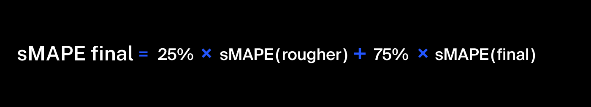

## Cálculo de la recuperación

Simular el proceso de recuperación del oro del mineral de oro.

Fórmula para simular el proceso de recuperación:

dónde:

    C:
        - Para saber la recuperación del concentrado rougher → la proporción de oro en el concentrado justo después de la flotación o
        - Para saber la recuperación del concentrado final → después de la purificación.

    F:
        - Para saber la recuperación del concentrado rougher → la proporción de oro en la alimentación antes de la flotación
        - Para saber la recuperación del concentrado final → en el concentrado justo después de la flotación.

    T:
        - Para saber la recuperación del concentrado rougher → la proporción de oro en las colas rougher justo después de la flotación.
        - Para saber la recuperación del concentrado final → después de la purificación.

Para predecir el coeficiente, hay que encontrar la proporción de oro en el concentrado y en las colas. Ten en cuenta que tanto el concentrado final como el concentrado rougher tienen importancia.

## Métricas de evaluación

Para resolver el problema, necesitaremos una nueva métrica. Se llama sMAPE, o error medio absoluto porcentual simétrico.

Es similar al MAE, pero se expresa en valores relativos en lugar de absolutos. ¿Por qué es simétrico? Porque tiene en cuenta la escala tanto del objetivo como de la predicción.

Así es como se calcula el sMAPE:

Designación:

    Valor del objetivo para la observación con el índice i en el conjunto utilizado para medir la calidad.

    Valor de la predicción para la observación con el índice i, por ejemplo, en la muestra de prueba.

    Número de observaciones de la muestra.

    Suma de todas las observaciones de la muestra (i toma valores de 1 a N).

Necesitamos predecir dos valores:

1. La recuperación del concentrado rougher *rougher.output.recovery.*
2. La recuperación final del concentrado *final.output.recovery.*

La métrica final incluye los dos valores:

