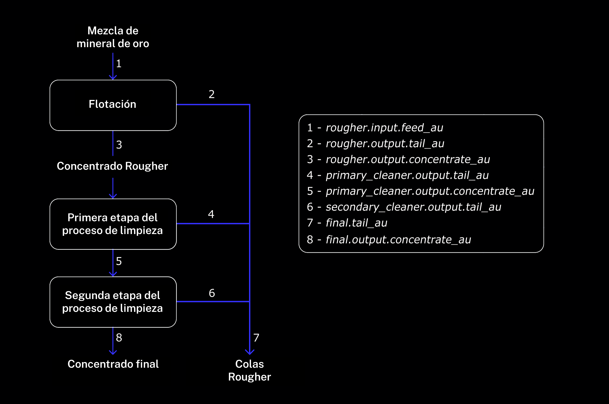

## Descripción de datos

### Proceso tecnológico

- **Rougher feed:** materia prima
- **Rougher additions** (o adiciones de reactivos): reactivos de flotación: xantato, sulfato, depresante
    - **Xantato:** promotor o activador de la flotación
    - **Sulfato:** sulfuro de sodio para este proceso en particular
    - **Depresante:** silicato de sodio
- **Rougher process:** flotación
- **Rougher tails:** residuos del producto
- **Float banks:** instalación de flotación
- **Cleaner process:** purificación
- **Rougher Au:** concentrado de oro rougher
- **Final Au:** concentrado de oro final

### Parámetros de las etapas

- **air amount:** volumen de aire
- **fluid levels**
- **feed size:** tamaño de las partículas de la alimentación
- **feed rate**

## Denominación de las características

Así es como se denominan las características:

[stage].[parameter_type].[parameter_name]

  Ejemplo: rougher.input.feed_ag 

Valores posibles para [stage]:

    rougher: flotación
    primary_cleaner: purificación primaria
    secondary_cleaner: purificación secundaria
    final: características finales

Valores posibles para [parameter_type]:

    input: parámetros de la materia prima
    output: parámetros del producto
    state: parámetros que caracterizan el estado actual de la etapa
    calculation: características de cálculo

